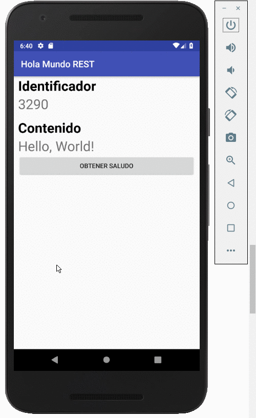
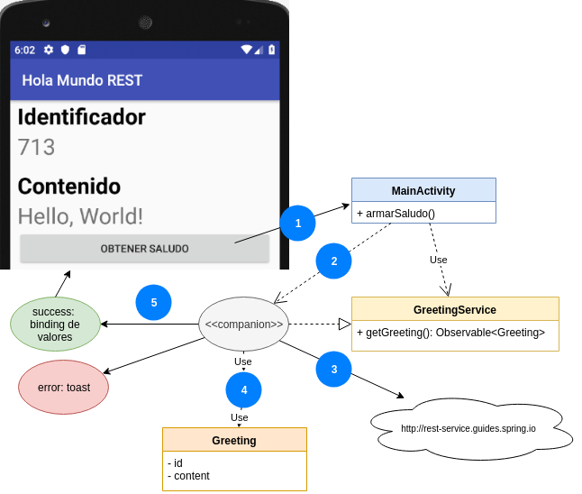

# Primer ejemplo básico REST desde Android



Hasta el momento hemos construido aplicaciones que funcionan dentro del entorno de nuestro dispositivo. Ahora vamos a establecer una comunicación con un nodo remoto, que ofrece un servicio a través de la web. 

## El proyecto

Este proyecto está generado para

- Android Studio 3.2.1 (Noviembre 2018)
- con Gradle 3.2.1 (el que viene con Android Studio)
- para una SDK 28 (Pie)

## Un saludo REST

Vamos a acceder a un servicio REST que está en un Web Server externo:

http://rest-service.guides.spring.io/greeting

(extraído de [este artículo](http://spring.io/guides/gs/rest-service/)). Esto nos devuelve un saludo, en formato JSON (Javascript Object Notation):

```json
{
    "id": 40530,
    "content": "Hello, World!"
}
```

¿Qué características tiene un servicio REST? Pueden leerlo [en esta página](https://algo3.uqbar-project.org/herramientas/angular/servicios-web-rest).

## El cliente

### Vista

La vista principal de nuestra aplicación Android es simple, cuenta con dos TextView que permiten visualizar id y contenido del saludo.

### Definición de un service

Utilizaremos el framework [Retrofit](https://square.github.io/retrofit/) que nos va a facilitar la llamada al servicio externo. Generamos entonces una interfaz que dice cómo vamos a acceder al web service:

```kt
interface GreetingService {
    @GET("/greeting")
    fun getGreeting(): Observable<Greeting>

    companion object {
        fun create(): GreetingService {
            val BASE_URL = "http://rest-service.guides.spring.io"

            val retrofit = Retrofit.Builder()
                    .baseUrl(BASE_URL)
                    .addConverterFactory(GsonConverterFactory.create())
                    .addCallAdapterFactory(RxJava2CallAdapterFactory.create())
                    .build()

            return retrofit.create(GreetingService::class.java)
        }
    }
}
```

- la annotation @GET define que vamos a hacer el request mediante un método GET
- creamos un [companion object de Kotlin](https://kotlinlang.org/docs/reference/object-declarations.html) para la interfaz `GreetingService`, lo que en otros lenguajes implementábamos como _well known objects_ o _singletons_, y en él definimos la URL base que será http://rest-service.guides.spring.io
- también debemos definir el path al que vamos a acceder dentro del server: en nuestro caso es la URL relativa "/greeting", eso termina formando http://rest-service.guides.spring.io/greeting
- en Retrofit 2.0 las llamadas pueden ser sincrónicas o asincrónicas, entonces el método getGreeting devuelve un Observable de un valor que representaremos con un objeto nuevo: Greeting, que tenemos que codificar
- la buena noticia es que no tenemos que recibir el JSON y convertirlo a un Greeting, esto lo hace retrofit utilizando como convención las propiedades del JSON devuelto (es lo que resuelve GsonConverterFactory). Si el JSON devuelve un objeto con propiedades id y content, es obvia la implementación de Greeting:

```kt
class Greeting {

    var id: String = null
    var content: String = null
}
```

### Llamada al service en la activity

La aplicación al iniciar construye un objeto Service, que se decora en base a la definición de nuestro GreetingService, **y se instancia en forma lazy** (la primera vez que se invoca), y necesita suscribirse al observer asincrónico pasándole

- un callback cuando el resultado fue correcto
- y otro callback para manejar los errores (código HTTP distinto de 200)

```kt
class MainActivity : AppCompatActivity() {

    val greetingService by lazy {
        GreetingService.create()
    }

    var disposable: Disposable? = null

    override fun onCreate(savedInstanceState: Bundle?) {
        super.onCreate(savedInstanceState)
        setContentView(R.layout.activity_main)
        findViewById<Button>(R.id.btnGreet).setOnClickListener { armarSaludo() }
        armarSaludo()
    }

    private fun armarSaludo() {
        disposable =
                greetingService.getGreeting()
                        .subscribeOn(Schedulers.io())
                        .observeOn(AndroidSchedulers.mainThread())
                        .subscribe(
                                { saludo ->
                                    lblId.text = saludo.id
                                    lblContent.text = saludo.content
                                },
                                { error ->
                                    Toast.makeText(this@MainActivity.applicationContext, "Ocurrió un error al buscar el saludo. ", Toast.LENGTH_LONG).show()
                                    Log.e("BasicRestApp", error.message)
                                }
                        )

    }
}
```

## Modificaciones en el Manifest

En el AndroidManifest debemos indicar que necesitamos el permiso del usuario para conectarnos a Internet:

```xml
<?xml version="1.0" encoding="utf-8"?>
<manifest xmlns:android="http://schemas.android.com/apk/res/android"
    package="uqbar.org.basicrestapp">
    <uses-permission android:name="android.permission.INTERNET" />
    <uses-permission android:name="android.permission.ACCESS_NETWORK_STATE" />
    <application
        android:networkSecurityConfig="@xml/network_security_config"
```

Pero además debemos crear un archivo de configuración de red `network_security_config.xml` que encontrarán en el directorio `res/xml`:

```xml
<?xml version="1.0" encoding="utf-8"?>
<network-security-config>
    <domain-config cleartextTrafficPermitted="true">
        <domain includeSubdomains="true">rest-service.guides.spring.io</domain>
    </domain-config>
</network-security-config>
```

Aquí habilitamos el acceso al dominio en cuestión.

## Arquitectura general


